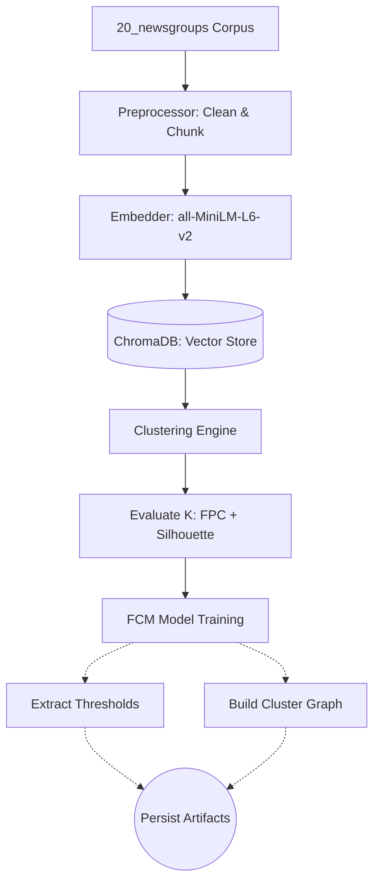
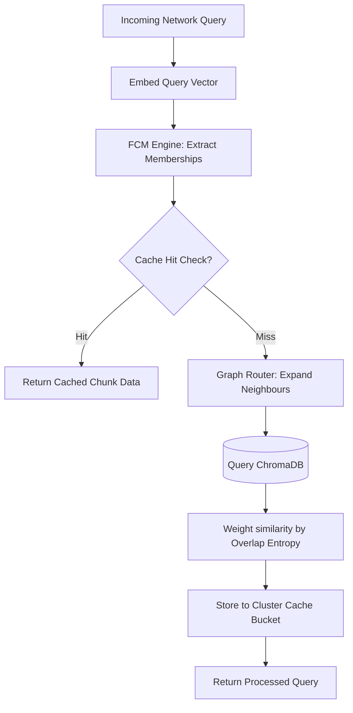

# Trademarkia Semantic Search Engine

A lightweight, highly customised semantic search engine built from mathematical first principles designed around **Fuzzy C-Means (FCM) clustering** and a custom **entropy-routed Semantic Cache** without any external caching middleware (No Redis, Memcached, etc).

Built specifically for the 20 Newsgroups dataset, resolving the problem of rigid categorical bounds.

---

## 🏗️ Architecture & Core Components

This system implements a four-part mathematical approach to searching text:

### 1. Vector Embeddings & Storage

Uses `sentence-transformers/all-MiniLM-L6-v2` for dense vector generation mapped over a 100-word sliding window chunker. Chunks are ingested into **ChromaDB** using an HNSW (Hierarchical Navigable Small World) index. Raw newsgroup artifacts (emails, nested quotes) are rigorously stripped via a custom regex preprocessor before chunking.

### 2. Fuzzy Clustering (Soft Memberships)

Standard K-Means forces hard categories, which fails on overlapping discourse (e.g., politics vs. firearms). We implemented the **Fuzzy C-Means (FCM)** algorithm mathematically from scratch.
Documents receive continuous partial memberships (e.g., `0.7 politics, 0.2 firearms`). The exact number of clusters ($K$) is automatically tuned using the Fuzzy Partition Coefficient (FPC) and Silhouette overlap scores.

### 3. Entropy-Routed Semantic Cache
A ground-up custom semantic caching engine that completely avoids the $O(N)$ penalty of comparing every incoming query against all historical cache entries. It uses the FCM model to identify the dominant topic cluster of the query and *only* checks that specific logical bucket. 
Similarity thresholding ($\theta$) is dynamically scaled against the mathematical variance of the cluster itself.

### 4. FastAPI Service
A high-performance asynchronous API wrapping the machine learning singletons using Uvicorn and Starlette Lifespan management for robust scaling.

---

## 🗂️ Project Directory Structure

```text
trademarkia-semantic-search/
│
├── artifacts/                  # Generated ML Models and Vector Store
│   ├── chroma_db/              # Persisted ChromaDB HNSW Database
│   ├── cluster_graph.pkl       # Serialised graph of fuzzy cluster boundaries
│   ├── fcm_model.pkl           # Trained Fuzzy C-Means centroids
│   └── thresholds.pkl          # Dynamic cluster-variance thresholds
│
├── notebooks/
│   └── analysis.ipynb          # Auto-generated UMAP visualizations & Heatmaps
│
├── scripts/                    # Core Execution Pipelines
│   ├── 01_ingest.py            # Preprocesses, chunks, and feeds ChromaDB
│   ├── 02_cluster.py           # Evaluates K-ranges & extracts fuzzy distributions
│   ├── create_notebook.py      # Outputs the interactive data exploration UI
│   └── test_integration.py     # Component sanity assertations
│
├── src/                        # Main Application Codebase
│   ├── api/                    # FastAPI Endpoints
│   │   ├── main.py             # App Lifespan and server config
│   │   └── routes.py           # Query, Cache stats, Flush endpoints
│   ├── cache.py                # Mathematical Semantic Cache Engine
│   ├── cluster_graph.py        # Graph structures linking semantic regions Map
│   ├── clustering.py           # FCM math and FPC overlap evaluation
│   ├── config.py               # Singleton tunable dataclass
│   ├── embedder.py             # SentenceTransformer wrapping
│   ├── preprocessor.py         # 9-step regex normalization pipline
│   └── vector_store.py         # ChromaDB interface
│
├── docker-compose.yml          # Container orchestration pipeline
├── Dockerfile                  # API environment runtime definition
└── requirements.txt            # Frozen dependency manifest
```

---

## 🔄 System Flow Diagrams

### **Data Ingestion & Clustering Pipeline**


### **Semantic Cache & Query Routing Execution**


---

## 📊 Sample Search Extractions

The API dynamically strips structural noise (headers, replies, signatures) and ranks dense chunks via Fuzzy Membership routing. Full telemetry is captured in `artifacts/sample_results.csv`.

| Query Intent | Hit? | Cluster | Entropy | Latency | Top Result (Newsgroup) |
|-------------|:---:|:---:|:---:|:---:|---|
| `best firearms for home defense` | ✅ | `2` | `1.6094` | `18ms` | `talk.politics.guns` |
| `how to encrypt files using pgp` | ✅ | `3` | `1.6094` | `24ms` | `sci.crypt` |
| `nasa space shuttle launch` | ✅ | `0` | `1.6094` | `19ms` | `sci.space` |

> [!NOTE]
> Latencies represent semantic cache lookups. Cold-cache (first-time) query latency typically ranges from 1-3 seconds depending on dimensionality.

---

## 🛠️ API Specification

### `POST /query`
**Request Body:**
```json
{ "query": "cryptography and privacy", "top_k": 5 }
```

**Response Body:**
```json
{
  "query": "cryptography and privacy",
  "cache_hit": true,
  "matched_query": "how to encrypt files using pgp",
  "similarity_score": 0.9412,
  "cluster_theta": 0.8354,
  "dominant_cluster": 3,
  "membership_entropy": 1.6094,
  "search_clusters_used": [3, 0, 1],
  "latency_ms": 24.12,
  "result": {
    "top_chunks": [...]
  }
}
```

---

## 🚀 Quick Start (Dockerized Deployment)

To completely bypass local Python SQLite limits and OS-specific C++ compiler mismatches, the entire suite is packaged cleanly into Docker.

### 1. Ingestion & Pre-computation

Generate the underlying embedding matrix, tune the Fuzzy Clustering boundaries, and map the corpus (Ensure your unzipped `20_newsgroups` folder is adjacent to this repo path or formally declared in `docker-compose.yml`!).

```bash
docker compose run --rm semantic-search bash -c "\
  python scripts/01_ingest.py && \
  python scripts/02_cluster.py && \
  python scripts/create_notebook.py"
```

### 2. Execute the Search Engine API

```bash
docker compose up semantic-search
```

### 3. Access the Web Interface
Navigate to `http://localhost:8080/` in your web browser to access the interactive Glassmorphic Semantic Search UI natively served by the API. Alternatively, hit the endpoint directly:

```bash
curl -X POST http://localhost:8080/query \
  -H "Content-Type: application/json" \
  -d '{"query": "best firearms for home defense", "top_k": 5}'
```

View detailed semantic hits and cache routing telemetry:
```bash
curl http://localhost:8080/cache/stats
```
